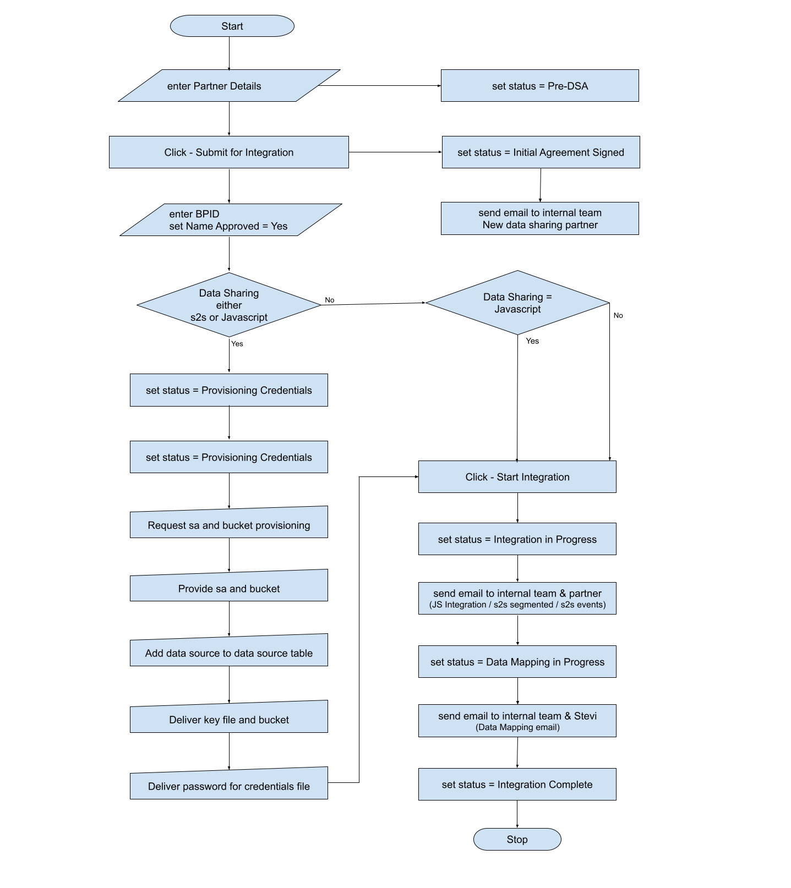
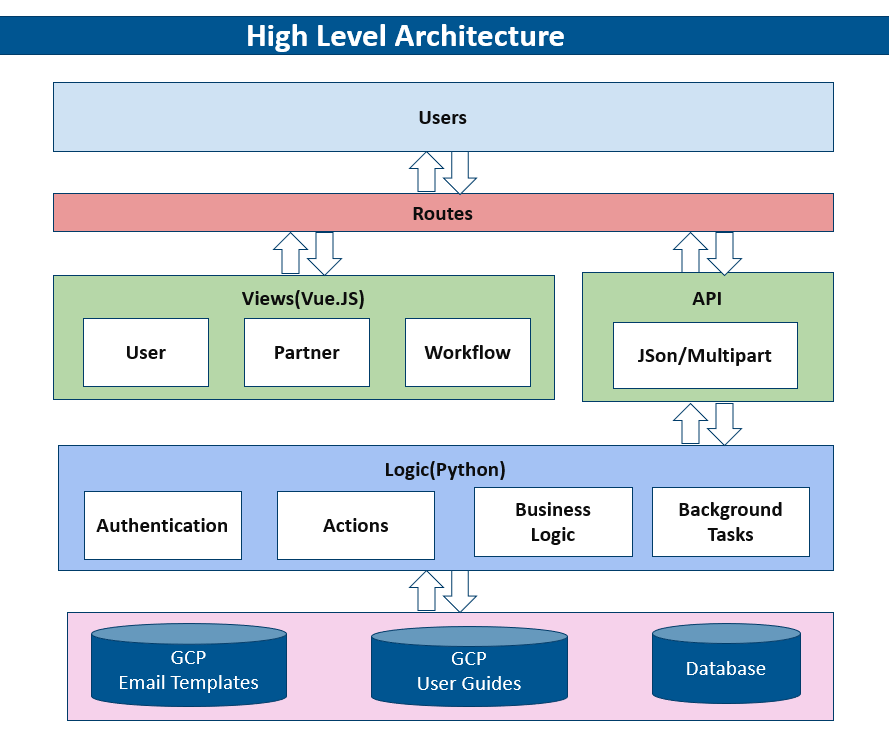
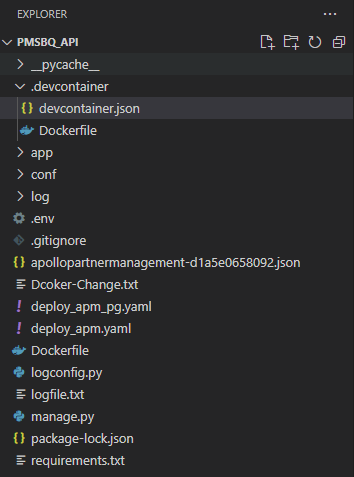
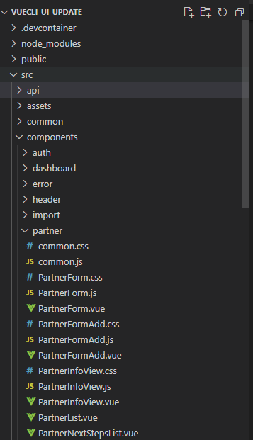

<!--
*** Thanks for checking out the Best-README-Template. If you have a suggestion
*** that would make this better, please fork the repo and create a pull request
*** or simply open an issue with the tag "enhancement".
*** Thanks again! Now go create something AMAZING! :D
-->


<!-- PROJECT SHIELDS -->
<!--
*** I'm using markdown "reference style" links for readability.
*** Reference links are enclosed in brackets [ ] instead of parentheses ( ).
*** See the bottom of this document for the declaration of the reference variables
*** for contributors-url, forks-url, etc. This is an optional, concise syntax you may use.
*** https://www.markdownguide.org/basic-syntax/#reference-style-links
-->


[![Contributors][contributors-shield]][contributors-url]
[![Forks][forks-shield]][forks-url]
[![Stargazers][stars-shield]][stars-url]
[![Issues][issues-shield]][issues-url]
[![MIT License][license-shield]][license-url]
[![LinkedIn][linkedin-shield]][linkedin-url]


<!-- PROJECT LOGO -->
<br />
<p align="center">
  <a href="http://www.corbus.com/">
    
  </a>

  <h3 align="center">Partner Management System</h3>

  <p align="center">
    A complete guide to setup and understand Opnen DMP - Partner Management System!
    <br />
  </p>
</p>


<!-- TABLE OF CONTENTS -->
<details open="open">
  <summary>Table of Contents</summary>
  <ol>
    <li>
      <a href="#about-the-project">About The Project</a>
      <ul>
        <li><a href="#technologies">Technologies</a></li>
      </ul>
    </li>
    <li>
      <a href="#getting-started">Getting Started</a>
      <ul>
        <li><a href="#prerequisites">Prerequisites</a></li>
        <li><a href="#installation">Installation</a></li>
		<li><a href="#application-flow">Application Flow</a></li>
		<li><a href="#high-level-architecture">High Level Architecture</a></li>
		<li><a href="#solution">Solution</a></li>
      </ul>
    </li>
    <!--<li><a href="#usage">Usage</a></li>-->
    <!--<li><a href="#roadmap">Roadmap</a></li>-->
    <li><a href="#contribution">Contribution</a></li>
    <!--<li><a href="#license">License</a></li>-->
    <li><a href="#contact">Contact</a></li>
    <!--<li><a href="#acknowledgements">Acknowledgements</a></li>-->
  </ol>
</details>


<!-- ABOUT THE PROJECT -->
## About The Project

[![Product Name Screen Shot][product-screenshot]](#)<!--(https://example.com) -->

Opend DMP - Partner Management System is a web based application. 
It has multiple roles for access control. 
It uses Google Bucket for it's email templates to give editors a next level of flexiblity.

<b>Modules :-</b>
* User Management - Add/Edit users, along with role assignment
* Partners Management - Add/Edit partners details along with configration related details.
* Partners Workflow - A complete guide to keep a watch on status of every step/workflow


### Technologies

The application developed with following frameworks/technologies.
* [Bootstrap - Vue](https://bootstrap-vue.org/docs/components)
* [Vue.js](https://vuejs.org/)
* [Python-Flask](https://flask.palletsprojects.com/en/2.0.x/)


<!-- GETTING STARTED -->
## Getting Started

To get a local copy up and running at your end please follow these simple steps.

### Prerequisites

This is an example of how to list things you need to use the software and how to install them.
* Visual Studio Code
  ```sh
  https://code.visualstudio.com/download
  ```
* Docker - Windows
  ```sh
  https://hub.docker.com/editions/community/docker-ce-desktop-windows/
  ```
* GitHub - Windows
  ```sh
  https://desktop.github.com/
  ```  
* NodeJS 
	```sh
	https://nodejs.org/en/download/  
	```
* npm
  ```sh
  npm install npm@latest -g
  ```
* pip
  ```sh
  pip install
  ```


### Installation

1. Clone the repo from git-hub to your local drive
	```sh
	https://github.com/CorbusCoration/PartnerManagementSystem
	```
	```sh
	git clone https://github.com/CorbusCoration/PartnerManagementSystem.git
	```
2. Make sure docker has been started. If docker is started but running but icon is greyed-out then run below command in powershell.
   ```sh
   & $Env:ProgramFiles\Docker\Docker\DockerCli.exe -SwitchDaemon
   ```
2. Install NPM packages - UI
   ```sh
   npm install
   ```
4. Install all dependencies - Python/Flask
   ```JS
   pip install -r requirements.txt -v
   ```


<!-- USAGE EXAMPLES 
## Usage

Use this space to show useful examples of how a project can be used. Additional screenshots, code examples and demos work well in this space. You may also link to more resources.

_For more examples, please refer to the [Documentation](https://example.com)_
-->


<!-- ROADMAP 
## Roadmap

See the [open issues](https://github.com/othneildrew/Best-README-Template/issues) for a list of proposed features (and known issues).
-->


<!-- CONTRIBUTING -->
## Contribution

To contribute, follow below steps(Git-Hub best practice). Any contributions you make are **greatly appreciated**.

1. Fetch latest version from master/main
2. Create your Feature Branch ('git checkout -b feature-Name')
3. Commit your Changes ('git commit -m 'feature-Name'')
4. Push to the Branch ('git push origin feature-Name')
5. Open a Pull Request
6. Assign pull request for Review and merge


## Application Flow
<p align="center">
	
</p>

## High Level Architecture
<p align="center">
	
</p>

## Solution

* pmsbq_api(Python) - Important Files
<table>
	<tr>
		<td width="35%" valign="top">
			
		</td>
		<td valign="top">
			1. <b>apollopartnermanagement-d1a5e0658092.json</b> - Google API Token file<br />
			2. <b>aapp/bqcredential/apollopartnermanagement-d1a5e0658092.json</b> - Google client secret key<br />
			3. <b>main/controller</b><br />
				<ul>
					<li>email_controller.py - This controller is used as a wrapper class for sending email notifications.</li>
					<li>login_controller.py - This controller handles all login related actions.</li>
					<li>partner_controller.py - This controller is used to handle partner's related data.</li>
					<li>user_controller.py - This is for managing users.</li>
					<li>utils_controller.py - This contains some reusable actions those are being used in another controllers.</li>
				</ul>
			4. <b>main/service</b><br />
				<ul>
					<li>auth_service.py - This contains authentication related services.</li>
					<li>import_service.py - This is used to import partner's information.</li>
					<li>partner_service.py - This contains partner's related services.</li>
					<li>user_service.py - This contains users's related services.</li>
					<li>utils_service.py - This contains reusable methods.</li>
				</ul>	
			5. <b>amain/config.py</b> - This contains all configurable values/settings.<br />
			6. <b>adocumentsHandling.py</b> - This contains all google bucket related methods.
		</td>
	</tr>
</table>

* vuecli_ui_update(Vue.JS) - Important Files
<table>
	<tr>
		<td width="35%" valign="top">
			
		</td>
		<td valign="top">
			1. <b>src/partner</b><br />
				<ul>
					<li>PartnerForm.vue - This view is used to edit partner's details.</li>
					<li>PartnerFormAdd.vue - This view is used to add partner's details.</li>
					<li>PartnerInfoView.vue - This view is used to view partner's details in read only view.</li>
					<li>PartnerList.vue - This view is used to show list of available partner basis on provided filter criteria.</li>
					<li>PartnerNextStepsList.vue - This view is used to provide status of each partner basis on provided filter criteria.</li>
				</ul>
			2. <b>src/reusable</b><br />
				<ul>
					<li>alertBox.vue - This is used for showing message to user.</li>
					<li>configsUpdateFormModal.vue - This is used for updating config.</li>
					<li>countriesUpdateFormModal.vue - This view is used to update countries.</li>
					<li>nextStepFormModal.vue - This view is used to handle next step of partner.</li>
					<li>optionsUpdateFormModal.vue - This view is used for updating options.</li>
				</ul>	
		</td>
	</tr>
</table>

<!-- LICENSE -->
## License

Distributed under the MIT License. See 'LICENSE' for more information.


<!-- CONTACT -->
## Contact

Chris Teuschler - [@linkedin](https://www.linkedin.com/in/chris-teuschler-1987a9114) - cteuschler@corbus.com <br/>
Betty Hakes - [@linkedin](https://www.linkedin.com/in/bettyhakes) - bhakes@corbus.com

Project Link: [https://github.com/your_username/repo_name](https://github.com/your_username/repo_name)


<!-- MARKDOWN LINKS & IMAGES -->
<!-- https://www.markdownguide.org/basic-syntax/#reference-style-links -->

<!--
[contributors-shield]: https://img.shields.io/github/contributors/othneildrew/Best-README-Template.svg?style=for-the-badge
[contributors-url]: https://github.com/othneildrew/Best-README-Template/graphs/contributors
[forks-shield]: https://img.shields.io/github/forks/othneildrew/Best-README-Template.svg?style=for-the-badge
[forks-url]: https://github.com/othneildrew/Best-README-Template/network/members
[stars-shield]: https://img.shields.io/github/stars/othneildrew/Best-README-Template.svg?style=for-the-badge
[stars-url]: https://github.com/othneildrew/Best-README-Template/stargazers
[issues-shield]: https://img.shields.io/github/issues/othneildrew/Best-README-Template.svg?style=for-the-badge
[issues-url]: https://github.com/othneildrew/Best-README-Template/issues
[license-shield]: https://img.shields.io/github/license/othneildrew/Best-README-Template.svg?style=for-the-badge
[license-url]: https://github.com/othneildrew/Best-README-Template/blob/master/LICENSE.txt
[linkedin-shield]: https://img.shields.io/badge/-LinkedIn-black.svg?style=for-the-badge&logo=linkedin&colorB=555
[linkedin-url]: https://linkedin.com/in/othneildrew
[product-screenshot]: read_me_digital_assets/DMP-Home.png
-->

[contributors-shield]: https://img.shields.io/github/contributors/othneildrew/Best-README-Template.svg?style=for-the-badge
[contributors-url]: #
[forks-shield]: https://img.shields.io/github/forks/othneildrew/Best-README-Template.svg?style=for-the-badge
[forks-url]: #
[stars-shield]: https://img.shields.io/github/stars/othneildrew/Best-README-Template.svg?style=for-the-badge
[stars-url]: #
[issues-shield]: https://img.shields.io/github/issues/othneildrew/Best-README-Template.svg?style=for-the-badge
[issues-url]: #
[license-shield]: https://img.shields.io/github/license/othneildrew/Best-README-Template.svg?style=for-the-badge
[license-url]: #
[linkedin-shield]: https://img.shields.io/badge/-LinkedIn-black.svg?style=for-the-badge&logo=linkedin&colorB=555
[linkedin-url]: https://in.linkedin.com/company/corbus-llc
[product-screenshot]: read_me_digital_assets/DMP-Home.png
